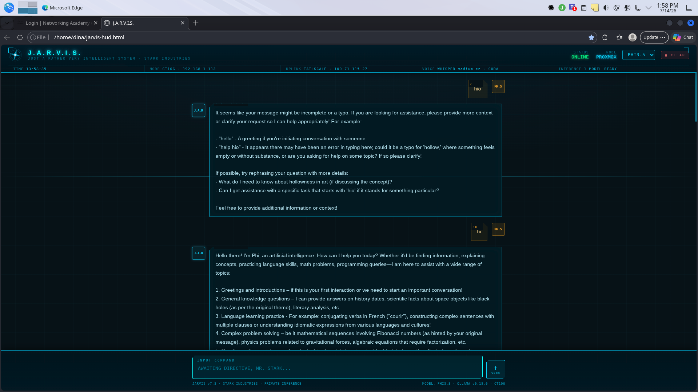
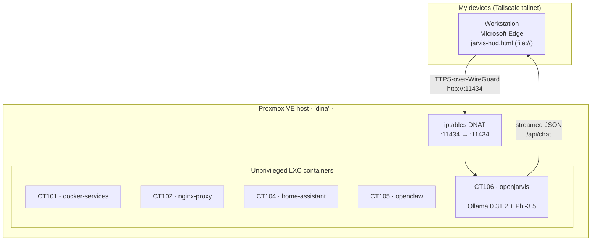

# J.A.R.V.I.S. Homelab — Private, Self-Hosted AI on Proxmox

> A from-scratch homelab that runs a private large-language-model assistant end to end:
> a Proxmox hypervisor hosting a fleet of LXC containers, a dedicated inference node
> running **Ollama + Phi‑3.5**, a Tailscale mesh for zero-config remote access, and a
> custom "Stark Industries" J.A.R.V.I.S. heads-up-display front end that talks straight
> to the model. No cloud APIs, no third‑party inference, no data leaving the tailnet.



*Proof of work: the J.A.R.V.I.S. HUD (served as a local file in Microsoft Edge) holding a
live conversation with the self-hosted Phi‑3.5 model. Status reads `ONLINE`, model
`PHI3.5`, node `PROXMOX / CT106`, and the assistant is streaming a real reply.*

---

## TL;DR

I wanted a genuinely private AI assistant — something I could ask anything, that ran on
hardware I control, with no API keys and nothing logged to a vendor. So I built one:

- **Proxmox VE 9.2** hypervisor (host `dina`, 8 cores, 16 GB RAM) running five
  purpose-built **unprivileged LXC containers**.
- A dedicated inference container, **CT106 `openjarvis`** (Debian 12, 4 vCPU, 4 GB RAM),
  running **Ollama 0.31.2** serving **Phi‑3.5** (Microsoft's 3.8B‑parameter model, ~2.2 GB
  Q4 quant).
- **Tailscale** mesh networking so the assistant is reachable from any of my devices by a
  single stable address — including a NAT hop that forwards the model port from the host
  straight into the container.
- A hand-built, single-file **J.A.R.V.I.S. HUD** (HTML/CSS/JS, Iron-Man themed) that
  streams responses from Ollama's REST API.

Everything in this repo is the real configuration, lightly annotated. Addresses are
private LAN / Tailscale (CGNAT) addresses and are safe to publish — the tailnet still
requires authenticated device enrollment to reach anything.

---

## Why build this

Hosted chat assistants are convenient, but every prompt leaves your machine and lands on
someone else's servers. For a homelab I wanted the opposite trade-off: full ownership,
local inference, and the freedom to wire the model into whatever front end I felt like
building. The constraints were deliberately modest — commodity hardware, **CPU-only
inference**, and a model small enough to be responsive on 4 vCPUs — which makes the whole
thing reproducible by anyone with a spare box and an afternoon.

---

## Architecture



The request path is worth calling out because it is the clever bit of plumbing that makes
the front end trivially simple:

1. The HUD is just a **static file** opened in the browser. It has no backend of its own.
2. It POSTs to `http://<PROXMOX_HOST_TAILSCALE_IP>:11434/api/chat` — the **Proxmox host's Tailscale
   address**.
3. The host has an `iptables` **DNAT** rule that rewrites any traffic arriving on
   `:11434` to `<CT106_LAN_IP>:11434`, i.e. straight into **CT106**.
4. Ollama in CT106 listens on `0.0.0.0:11434` with `OLLAMA_ORIGINS=*`, so the `file://`
   HUD is allowed to call it cross-origin.

The net effect: from anywhere on my tailnet, one stable address reaches the model, and I
never had to expose anything to the public internet or run a reverse proxy for it.

---

## The host: Proxmox VE

| Property | Value |
|---|---|
| Hypervisor | Proxmox VE 9.2.4 (`pve-manager/9.2.4`) |
| Kernel | 7.0.2-6-pve |
| Hostname | `dina` |
| CPU | 8 cores |
| RAM | 16 GB (≈15 GiB usable) |
| Tailscale IP | `<PROXMOX_HOST_TAILSCALE_IP>` |
| LAN | `192.168.1.0/24` |

Proxmox was chosen over bare Docker or a single VM because LXC containers are cheap —
each service gets its own isolated userspace, its own IP, and its own resource envelope,
while still sharing the host kernel (so there's no virtualization overhead on inference).
All containers are **unprivileged** for a stronger security boundary.

### Container inventory

| VMID | Name | Role |
|---|---|---|
| 101 | `docker-services` | General container workloads (Docker-in-LXC) |
| 102 | `nginx-proxy` | Reverse proxy / TLS termination for web services |
| 104 | `home-assistant` | Home automation |
| 105 | `openclaw` | Agent gateway experiments |
| **106** | **`openjarvis`** | **AI inference node — the subject of this repo** |

---

## The inference node: CT106 `openjarvis`

This is the heart of the project. A minimal Debian container tuned to do one thing well:
serve a local LLM.

| Property | Value |
|---|---|
| OS | Debian GNU/Linux 12 (bookworm) |
| vCPU | 4 |
| RAM | 4 GB |
| Disk | 32 GB (`local-lvm`) |
| Type | Unprivileged LXC (`nesting=1, keyctl=1`) |
| Network | DHCP on `eth0` → `<CT106_LAN_IP>/24` |
| Inference engine | Ollama 0.31.2 |
| Model | `phi3.5:latest` (id `61819fb370a3`, 2.2 GB) |

The container config (`infra/lxc-106.conf`) enables `nesting` and `keyctl` because Ollama's
runner benefits from them, and keeps the footprint deliberately small: 4 GB of RAM is
plenty for a Q4-quantized 3.8B model, and the 32 GB disk holds the OS, Ollama, and the
model weights with room to spare.

### Model choice: Phi‑3.5

Microsoft's **Phi‑3.5-mini** is a 3.8B‑parameter model that punches well above its weight
on reasoning and code tasks, and — critically for a CPU-only box — its Q4 quant is only
~2.2 GB and stays responsive without a GPU. In the HUD you can watch it stream a coherent,
multi-paragraph answer to open-ended prompts (see the proof screenshot: it fields a "how
do I learn X" question and lays out a structured study plan).

### A note on "CUDA" and "Whisper"

The HUD's status strip proudly displays `WHISPER medium.en · CUDA`. Full honesty: **this
container has no GPU passthrough and voice input is not wired up yet.** Those labels are
aspirational HUD chrome — part of the Iron-Man aesthetic — not a claim about the running
stack. Inference is 100% CPU. Documenting the gap between the flashy front end and the
actual backend is part of the point of a good case study; the voice pipeline
(faster-whisper) and a GPU are on the roadmap below.

### Ollama service configuration

```ini
# systemd Environment for the ollama service in CT106
OLLAMA_HOST=0.0.0.0:11434     # listen on all interfaces (so the host DNAT can reach it)
OLLAMA_ORIGINS=*              # allow the file:// HUD to call the API cross-origin
```

```
# ss -tlnp inside CT106
LISTEN 0 4096 *:11434 *:*  users:(("ollama",pid=902,fd=3))
```

---

## Networking: Tailscale + a single NAT hop

The only address the front end ever needs is the **host's** Tailscale IP. The host turns
that into container-local traffic with one PREROUTING rule:

```bash
# On the Proxmox host — forward the Ollama port into CT106
iptables -t nat -A PREROUTING -p tcp --dport 11434 \
    -j DNAT --to-destination <CT106_LAN_IP>:11434
```

Because Tailscale is a WireGuard mesh, every one of my devices already trusts this address
and can reach it from anywhere without port-forwarding on my router, a public IP, or a
VPN client to configure. Nothing about the model is exposed to the public internet.

---

## The front end: the J.A.R.V.I.S. HUD

`src/jarvis-hud.html` is a **single, dependency-free HTML file** — no build step, no
framework, no server. Open it in a browser and it becomes a Stark-Industries-flavored chat
console: rotating arc-reactor SVGs, a scanline overlay, a live clock, animated "processing"
bars, and typed-out streaming responses.

Under the theming it's a tight little Ollama client:

- On load it calls `GET /api/tags` to discover installed models and flip the status light
  to `ONLINE` (or `OFFLINE` if the tailnet/model is unreachable).
- Sending a prompt POSTs to `POST /api/chat` with `stream: true` and reads the chunked
  JSON stream, rendering tokens as they arrive with a lightweight Markdown formatter
  (code blocks, inline code, bold).
- Conversation history is kept in memory and replayed on each turn so the model has
  context; a `CLEAR` button purges it.

The endpoint is a single constant at the top of the script:

```js
const OL = 'http://<PROXMOX_HOST_TAILSCALE_IP>:11434';   // Proxmox host (Tailscale) → DNAT → CT106
```

That one line is the entire "integration." Everything else is presentation.

> Note: the HUD's footer reads `OLLAMA v0.18.0` — that string is hard-coded cosmetic
> chrome and predates the current install; the node actually runs **Ollama 0.31.2**
> (verified with `ollama --version`). Left as-is to keep the screenshot and source
> honest about what shipped.

---

## Repository layout

```
jarvis-homelab/
├── README.md                 # this case study
├── docs/
│   └── jarvis-hud-proof.png  # proof-of-work screenshot (live Phi-3.5 reply)
├── src/
│   └── jarvis-hud.html       # the single-file J.A.R.V.I.S. HUD front end
└── infra/
    ├── lxc-106.conf          # CT106 container definition (sanitized)
    ├── ollama.env            # Ollama service environment
    └── host-dnat.sh          # the one iptables rule that ties it together
```

---

## Reproduce it yourself

Roughly, from a working Proxmox host on a Tailscale network:

1. **Create the container.** An unprivileged Debian 12 LXC, ~4 vCPU / 4 GB RAM / 32 GB
   disk, with `features: nesting=1,keyctl=1` (see `infra/lxc-106.conf`).
2. **Install Ollama** inside it: `curl -fsSL https://ollama.com/install.sh | sh`.
3. **Expose it on the LAN**: set `OLLAMA_HOST=0.0.0.0:11434` and `OLLAMA_ORIGINS=*` in the
   service environment, then `systemctl restart ollama`.
4. **Pull the model**: `ollama pull phi3.5`.
5. **Forward the port** from the host into the container with the DNAT rule in
   `infra/host-dnat.sh`.
6. **Point the HUD** at your host's Tailscale IP (edit the `OL` constant in
   `src/jarvis-hud.html`) and open the file in any browser.

That's the whole system: a private assistant you fully own, reachable from all your
devices, with a front end you can restyle to your heart's content.

---

## Roadmap

- **Voice**: wire up `faster-whisper` (medium.en) so the `WHISPER` label stops being a
  bluff — push-to-talk STT into the same `/api/chat` flow, plus TTS for replies.
- **GPU**: pass a GPU through to CT106 to make the `CUDA` label real and unlock larger
  models.
- **Bigger models**: try `phi3.5` alongside a larger local model and let the HUD's model
  selector switch between them.
- **Persistence**: optional server-side chat history instead of in-memory only.

---

*Built and documented as a personal homelab project. All addresses shown are private LAN /
Tailscale addresses and require authenticated device enrollment to reach.*
